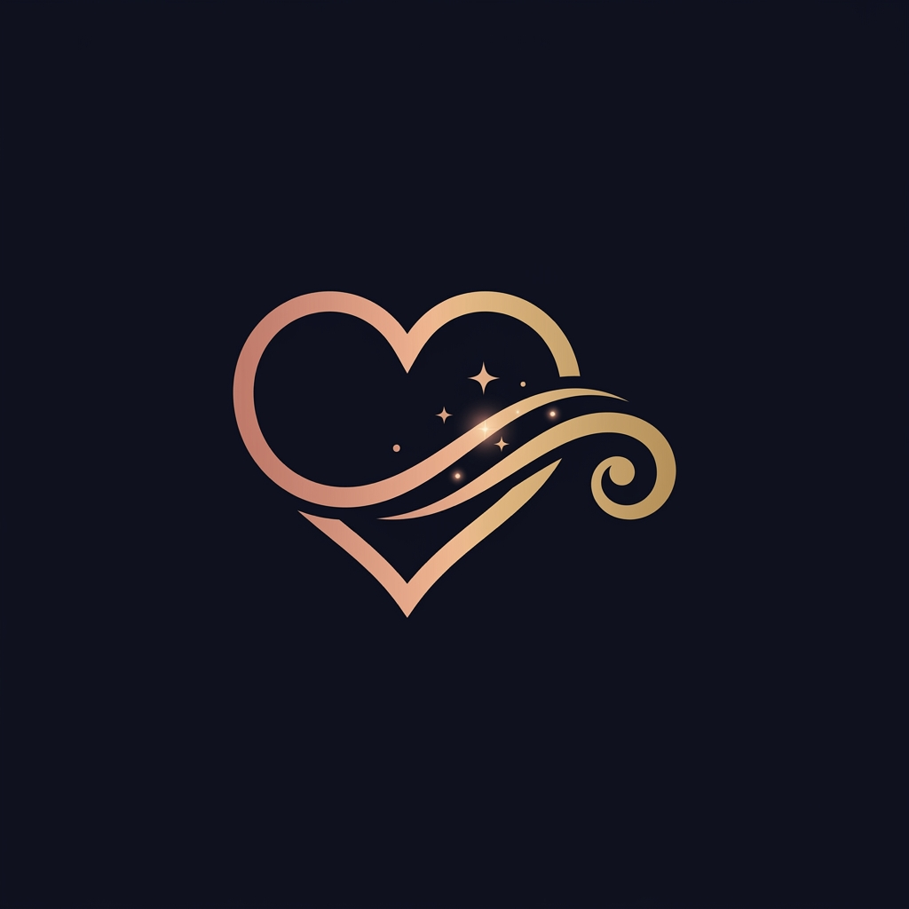

  
  <h1>ScrollHeart</h1>
  
<em>Build her a story she can scroll through.</em>

  
A warm, gentle AI skill that helps a boy create a romantic, scroll-driven storytelling website for a girl he cares about.

---

## 📖 What This Project Is

**ScrollHeart** is an AI-powered skill system that helps you create a personalized, romantic, scroll-driven storytelling website. The entire experience is built inside an AI IDE (Antigravity, Claude Code, Cursor, Windsurf, etc.) through a friendly, conversational workflow.

### Features
- **Conversation-first:** Asks about HER, not about the project.
- **Safety-first:** Auto-detects and rejects creepy/pushy content.
- **Story-first:** Builds around an emotional arc, not a generic template.
- **Privacy-first:** Private link, no tracking, no public sharing by default.
- **Zero Build Tools:** Generates pure HTML/CSS/JS that can be hosted for free on GitHub Pages.
- **Mobile-first:** Responsive design with GSAP ScrollTrigger animations, parallax layers, and optimal performance under 2MB.

---

## 🚀 How to Use ScrollHeart with Different AI Agents

ScrollHeart is compatible with multiple AI coding agents. If you are starting with a fresh AI agent, use the corresponding setup prompt below to initialize the skill in your environment:

### 🌌 Antigravity IDE
> "Please clone the repository `https://github.com/krishujeniya/ScrollHeart.git` to my workspace. Once cloned, the Antigravity IDE will automatically discover the skill in the `.agents/skills` folder. Let me know when you are ready to begin the ScrollHeart workflow."

### 🤖 Claude Code
> "Please clone `https://github.com/krishujeniya/ScrollHeart.git`. Then, navigate into the directory and read the `CLAUDE.md` and `SKILL.md` files to learn your instructions and brand voice. Ask me if I'm ready to begin once you understand the 5-phase workflow."

### 🖱️ Cursor
> "Please run `git clone https://github.com/krishujeniya/ScrollHeart.git`. Then open that folder in Cursor so the `.cursor/rules/scrollheart.mdc` rule is activated. Once you've read the rules and the `SKILL.md` file, say hello as 'The Calm Bestie' and let's begin."

### 🏄‍♂️ Windsurf
> "Please clone `https://github.com/krishujeniya/ScrollHeart.git`. Make sure to read the `.windsurf/rules/scrollheart.md` file and the main `SKILL.md` to adopt the ScrollHeart persona and workflow. Let me know when you are ready."

### Other Agents
> "Please clone `https://github.com/krishujeniya/ScrollHeart.git` and thoroughly read `SKILL.md` and `AGENTS.md` at the root of the project to learn your instructions, brand voice, and the 5-phase workflow. When you understand how to operate as the ScrollHeart skill, say hello and ask if I'm ready to begin."

---

## 🛠️ The 5-Phase Workflow

When you trigger ScrollHeart, the AI acts as "The Calm Bestie" and guides you through:

1. **Interview:** 10 conversational questions about her personality, memories, and preferences.
2. **Safety Check:** Evaluates answers against a "Green Flag" commitment to prevent pushy, creepy, or guilt-inducing language. 
3. **Design Brief:** Generates a custom design spec (colors, fonts, animation style) based on your answers for your approval.
4. **Code Generation:** Builds a static HTML/CSS/JS site with GSAP ScrollTrigger (5 scenes).
5. **Post-Build Guidance:** Coaches you on how to host it on GitHub Pages and how to present the gift gracefully.

---

## 🎨 Scene & Narrative Structure

The generated websites follow a 5-scene emotional arc:
1. **The First Glance (Intro):** Setting the mood with light curiosity.
2. **The Silent Conversation (Verse):** Building context and sharing a memory.
3. **The Climax (Chorus):** The emotional peak and core message.
4. **Quiet Night (Bridge):** A reflective, quiet perspective shift.
5. **Outro & CTA (Finish):** A gentle, no-pressure conclusion.

Each scene uses 4 parallax layers (Background, Midground, Foreground, Text) driven by the user's scroll.

---

## 🛡️ Emotional Safety Framework

We believe the best gifts aren't bought, they're built—and they should always feel safe. ScrollHeart includes a 20-point Red Flag Detection Algorithm. 

**ScrollHeart will NEVER:**
- Assume she owes you a response.
- Use guilt language or pressure.
- Include private information (real names/photos) without explicit consent.
- Create overwhelming length or use countdown timers.
- Auto-play audio loudly.

**ScrollHeart will ALWAYS:**
- Suggest gentler alternatives when things feel too intense.
- Put her in control of the pacing via scroll-driven storytelling.
- Include a no-pressure CTA (e.g., "Replay the story").
- Respect privacy by disabling search indexing and analytics.

---

## 📁 Repository Structure

- `SKILL.md` — The core AI skill instruction file.
- `AGENTS.md` — Universal rules for AI agents.
- `references/` — Progressive loading files for the 5-phase workflow (Interview, Safety, Design, Code, Deployment).
- `resources/` — Curated JSON data for color palettes, font pairings, and song suggestions.
- `examples/` — A complete reference implementation of a ScrollHeart story.

---

  
<em>Made with heart. Built with code. Given with courage. 💫</em>

